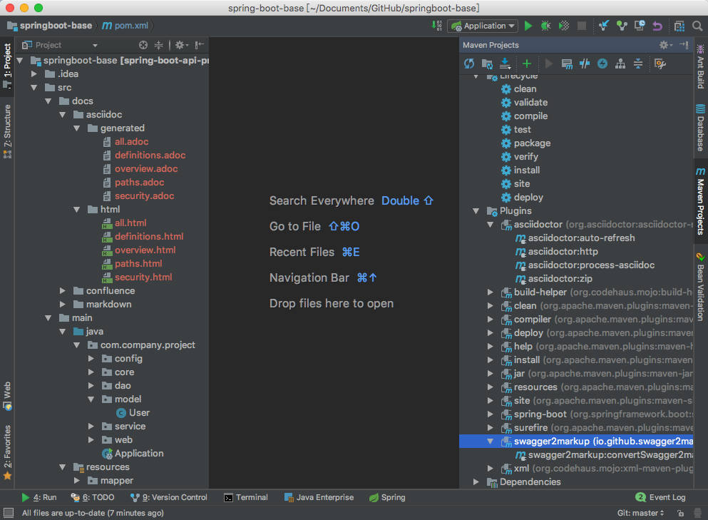
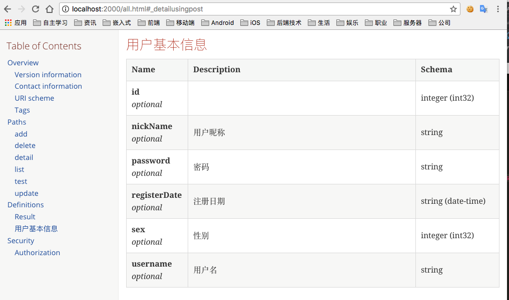

# spring-boot-base

spring-boot-base

Spring Boot 脚手架的小工程，用于快速构建基于Spring Boot 的API后台。

项目技术架构：

* Spring-Boot 1.5.9.RELEASE
* lombok
* Mybatis
* Tk.mybatis
* Pagehelper
* Druid
* MySQL

## 代码自动生成

1. 详情见单元测试test中的`CodeGenerator`.
2. 修改`CodeGenerator`中的数据库连接等属性。
3. 修改`CodeGenerator`中的表名，`main()` 方法，自动生成各层基础代码。

```java
public static void main(String[] args) {
    genCode("user");
//  genCode("输入表名");
//  genCodeByCustomModelName("输入表名","输入自定义Model名称");
}
```

## API 文档生成 

方法一：

java代码生成

1. 启动项目`Application`,保证 `http://localhost:8080/v2/api-docs` 接口可以访问，API文档生成需要。
2. 运行test项目下的 `GenerateApiDocs` 测试用例生成API文档。

方法二：

maven插件生成

1. 运行下面命令在`src/docs/asciidoc/generated`下生成asciidoc接口文档代码。

```java
mvn swagger2markup:convertSwagger2markup
```
2. 运行下面命令在`src/docs/asciidoc/html`下生成html接口文档代码。

```java
mvn asciidoctor:process-asciidoc
```

> 推荐使用 IntelliJ IDEA 右边栏的 maven 工具直接执行命令。



